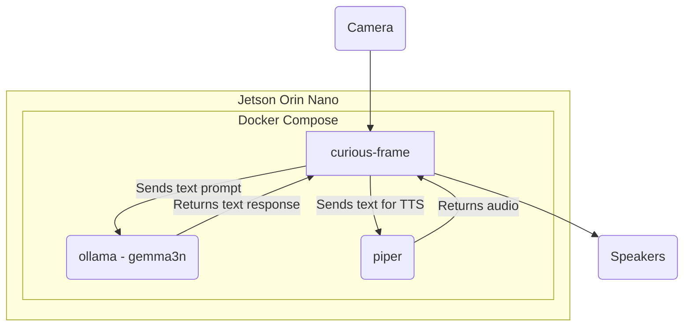

# Curious Frame

Curious Frame is a Python application designed for the Gemma3n Impact Challenge. It serves as an interactive, offline-ready learning experience for curious kids supporting multi-languages. The application uses a camera to identify objects and "action cards" presented within a physical frame, and then uses the Gemma3n model to provide educational information about the objects through speech.

## How to Test

To run this project, you'll need a NVIDIA® Jetson Orin Nano™ Developer Kit with JetPack 6.2.1 installed; see [Initial Setup Guide](https://www.jetson-ai-lab.com/initial_setup_jon.html).

Then set up the NVMe SSD (strongly recommended) as explained in that [Jetson AI Lab tutorial](https://www.jetson-ai-lab.com/tips_ssd-docker.html). And optimize the configuration for the RAM by disabling the desktop GUI and mounting SWAP to the NVMe SSD; see [that tutorial](https://www.jetson-ai-lab.com/tips_ram-optimization.html).

You will need a cardboard frame. The one I did has the following dimensions:

The action cards can be found in [./assets/illustrations.odt](./assets/illustrations.odt) - to be printed on a standard paper printer.

Get the code, running the following commands:

```bash
git clone https://github.com/webscit/curious-frame.git
cd curious-frame
```

Run the application using the following command:

```bash
docker compose up
```

## Architecture

The application is composed of three main services orchestrated by Docker Compose:

-   `curious-frame`: The main application service, written in Python. It captures video from the camera, processes the images to detect objects and action cards, and interacts with the other services to generate a response.
-   `ollama`: This service runs the Gemma3n large language model. The `curious-frame` service sends requests to this service to get information about the objects identified in the camera stream and to translate the text if the appropriate language.
-   `piper`: This service is responsible for text-to-speech (TTS). The `curious-frame` service sends the text generated by the `ollama` service to `piper` to be converted into audio, which is then played back to the user.

Here is a diagram of the architecture:


