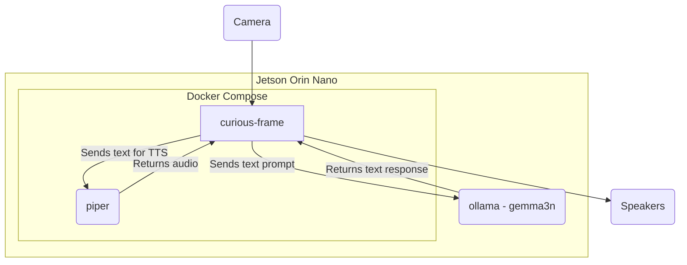
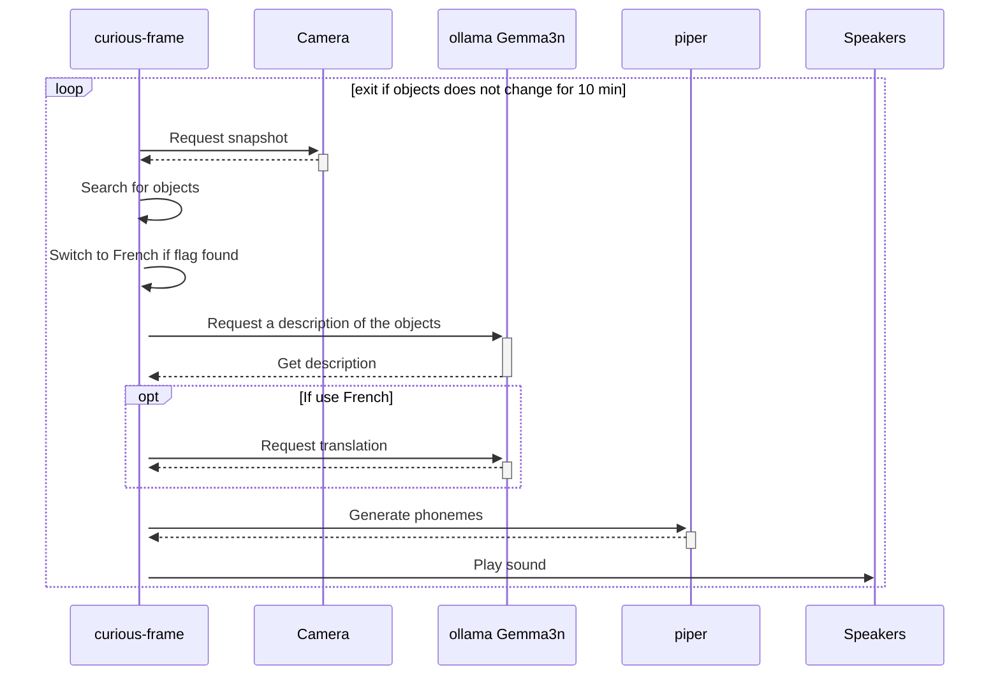

# Curious Frame

Curious Frame is a Python application designed for the Gemma3n Impact Challenge. It serves as an interactive, offline-ready learning experience for curious kids supporting multi-languages. The application uses a camera to identify objects and "action cards" presented within a physical frame, and then uses the Gemma3n model to provide educational information about the objects through speech.

## How to Install

To run this project, you'll need a NVIDIA® Jetson Orin Nano™ Developer Kit with JetPack 6.2.1 installed; see [Initial Setup Guide](https://www.jetson-ai-lab.com/initial_setup_jon.html).

Then set up the NVMe SSD (strongly recommended) as explained in that [Jetson AI Lab tutorial](https://www.jetson-ai-lab.com/tips_ssd-docker.html). And optimize the configuration for the RAM by disabling the desktop GUI and mounting SWAP to the NVMe SSD; see [that tutorial](https://www.jetson-ai-lab.com/tips_ram-optimization.html).

> With that setup, it is highly recommended to connect to the Jetson Nano using SSH rather than screen and keyboard.

You will need a cardboard frame. The one I did has the following dimensions:

The action cards can be found in [./assets/illustrations.odt](./assets/illustrations.odt) - to be printed on a standard paper printer.

Get the code and setup the nano, running the following commands:

```bash
git clone https://github.com/webscit/curious-frame.git
cd curious-frame
bash ./setup.sh
```

From now on, the application should start automatically when the Jetson Nano is started. The application will shutdown after 10 minutes if no new objects are detected.

Here are some usefull commands in case you are logged in to the Jetson Nano:

```bash
# Stop the service
sudo systemctl stop curious_frame.service
# Start the service
sudo systemctl start curious_frame.service
# Display the service log
journalctl -u curious_frame.service -f
```

What got installed:
- `ollama` on the host machine - it is installed to start automatically with the Jetson Nano
- a custom service `curious_frame` to start the containers automatically with the Jetson Nano

That's it! Everything else is within Docker containers.

> The container will use the host network. So be careful as the configuration
> is for development only as its missing security features.

## How to uninstall

- Uninstall the `curious_frame` service by executing the command:

```
sudo systemctl stop curious_frame
sudo systemctl disable curious_frame
sudo rm /etc/systemd/system/curious_frame.service
sudo rm /usr/local/bin/curious_frame.sh
```

- To uninstall `ollama`, look at the [official documentation](https://github.com/ollama/ollama/blob/main/docs/linux.md#uninstall)

## FAQ

- **My camera is not recognized**.

This is one of the trickiest part of this project. There are no easy answer and it depends if you are using a USB or a CSI camera.
In any case, you can look at the code in `src/curious_frame/camera.py` and try to adapt it for your case.  
Of note, you can change the camera id, its resolution and its frame rate through command line; see `src/curious_frame/main.py`.
The command line for the `curious-frame` can then be updated in the `docker-compose.yaml` file. Then execute the following command:

```sh
sudo systemctl stop curious_frame
docker compose build
sudo systemctl start curious_frame
```

- **No sound is emitted**.

The sound is emitted using alsa tool `aplay`. It defaults to the `sysdefault` device. You can change that
by using the command line argument `--audio-device <device>`. And the list of devices can be found by executing `aplay -L` (you may need to install it using `sudo apt install alsa-utils`).

- **The disk is full**.

The docker compose is parametrized to mount the local folders `snapshots` and `audio_cache` in the cloned repository. The first
one is storing the snapshots taken by the application and a CSV file with the VLM and LLM responses. The second folder caches
the WAV files generated by piper. If you are running out of space, you can safely remove them.

## Architecture

The application is composed of three main services orchestrated by Docker Compose:

-   `curious-frame`: The main application service, written in Python. It captures video from the camera, processes the images to detect objects and action cards, and interacts with the other services to generate a response.
-   `ollama`: This service runs the Gemma3n large language model. The `curious-frame` service sends requests to this service to get information about the objects identified in the camera stream and to translate the text if the appropriate language.
-   `piper`: This service is responsible for text-to-speech (TTS). The `curious-frame` service sends the text generated by the `ollama` service to `piper` to be converted into audio, which is then played back to the user.

Here is a diagram of the architecture:



Here is the sequence diagram:


